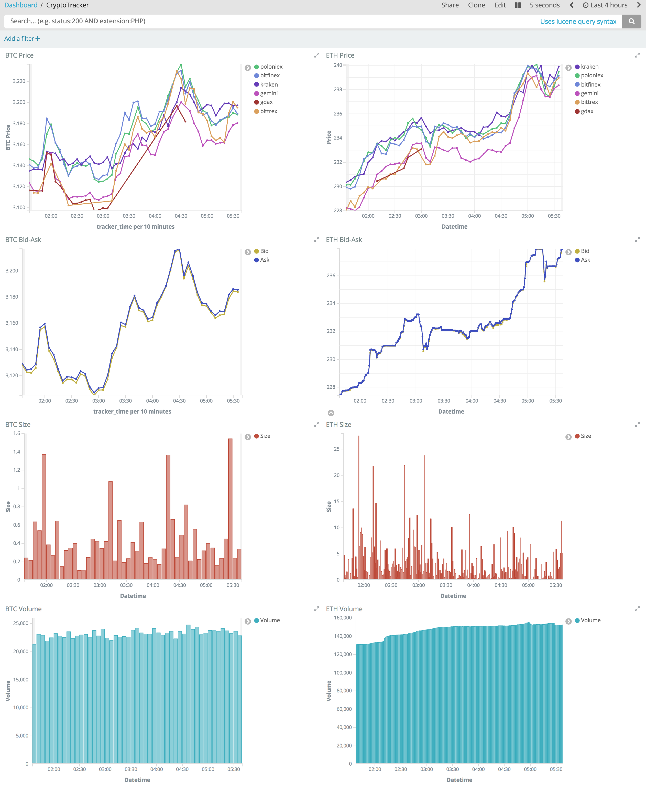

# Collector
This is a complete setup for collecting, storing, analyzing, visualizing, and monitoring cryptocurrency data. You can use this open source project to track Price, Bid/Ask Spreads, Size, and Volume, test hypotheses about markets, build machine learning models to predict price movements, understand volatility, arbitrage / algorithmically trade, and more. 

Pull Requests welcome and encouraged.

# Supported Exchanges (through ccxt)
 1. [BitTrex](https://bittrex.com/)
 2. [Kraken](https://kraken.com)
 3. [Cryptopia](https://www.cryptopia.co.nz/)
 4. [Poloniex](https://poloniex.com)
 5. [BitMex](https://www.bitmex.com)

# Examples of data visualization



# Requirements
1. [Docker](https://www.docker.com/community-edition)

# Running
```js
docker-compose build && docker-compose up
```
This command will build and launch 3 docker containers: Elasticsearch, Kibana, and python3. Elasticsearch is used as our datastore, Kibana is used to setup visualizations and dashboards, and python3 operates an asynchronous collector that request and store exchange data. Elasticsearch and Kibana are customizable via .yml and Dockerfiles (included). Once the system loads, which could take a few minutes, you should be able to navigate to Kibana to see all of the data that's flowing from the exchanges into Elasticsearch.

http://localhost:5601/

If this is the first time running Kibana, it may take an additional minute to load as the container runs it's initial optimization script. You will also need to add the following index patterns, with Time-field name being set to tracker_time:

```js
eth.*.ticker
btc.*.ticker
*.*.ticker
```

 A json file containing saved objects and dashboards is provided under /resources. This file can be imported from Kibana's UI by navigating to Management->Saved Objects->Import. Auto-Refresh interval on all dashboard has been preconfigured for 5 seconds.

# Production Settings
 On a live system, vm_map_max_count should be permanently set in /etc/sysctl.conf:
```js
 $ grep vm.max_map_count /etc/sysctl.conf
 vm.max_map_count=262144
```

# Additional Resources
In a development environment, a kibana configuration script is provided at resources/configure-kibana.sh to help automatically set default indexes, set refresh timers, and import all the graphs/dashboards. This configuration script is not recommended in production yet due to occasional issues with the discover tab not responding after import.

# License information
This software is originally based on https://github.com/ferluht/CryptoTracker which is fork of https://github.com/EthVentures/CryptoTracker by EthVentures. 
